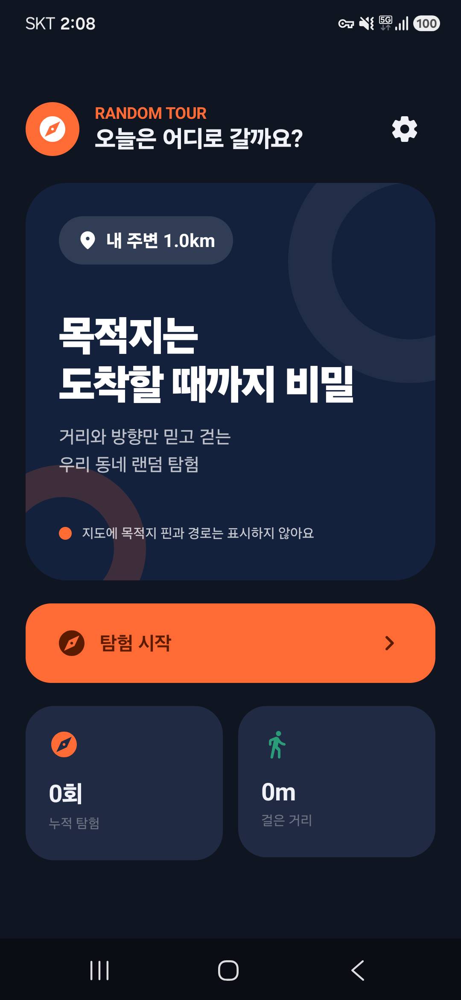
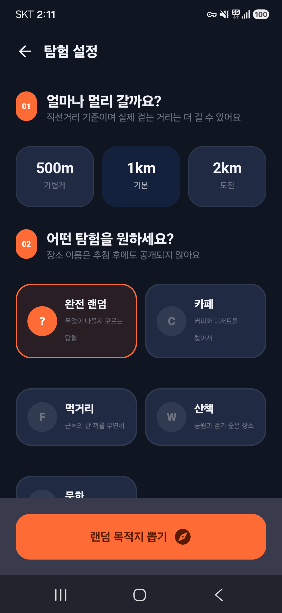
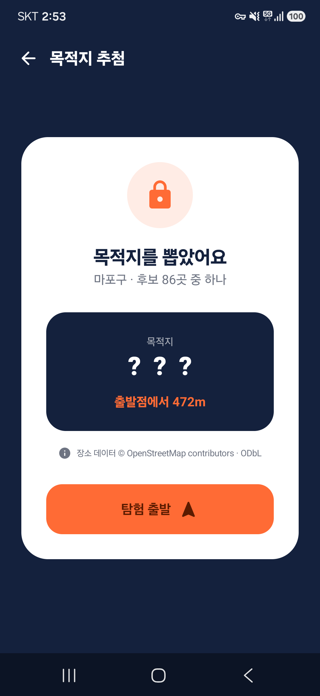
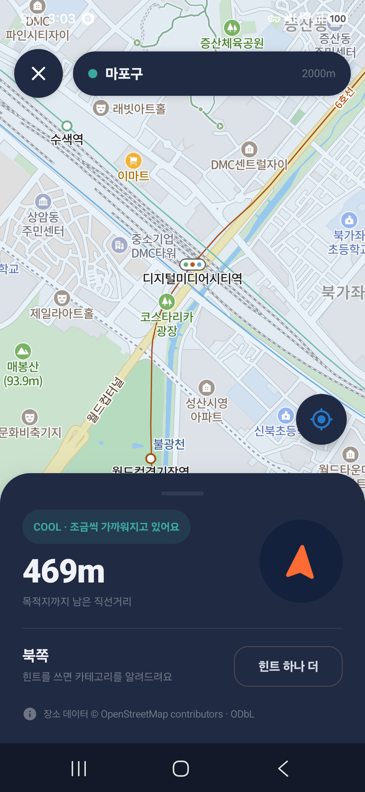
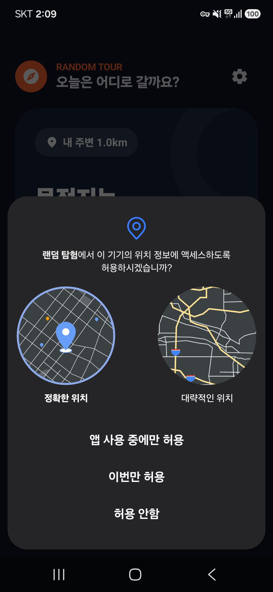
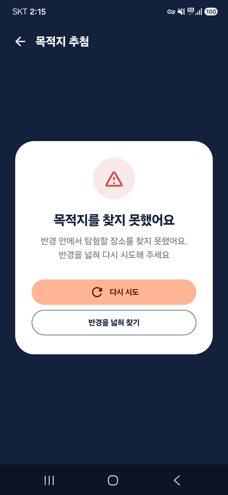

# Random Tour

### 목적지를 모를 때, 익숙한 동네가 탐험이 된다

현재 위치 주변의 실제 장소를 무작위로 뽑고 
거리·방향·온도 힌트만으로 찾아가는 Android 위치 기반 탐험 앱

## 프로젝트 한눈에 보기

Random Tour는 목적지와 최단 경로를 먼저 보여주는 일반적인 지도 경험을 뒤집은 앱입니다. 사용자가 반경·테마·힌트 난이도를 정하면 주변 장소 하나를 뽑지만, 도착 전까지 장소명과 목적지 핀은 공개하지 않습니다.

새 버전에서는 별도 후보 서버와 Android Geocoder의 POI 검색에 의존하던 구조를 없앴습니다. OpenStreetMap Overpass를 1차 장소 소스로 사용하고, 공개 데이터가 부족하거나 응답하지 않으면 NAVER 지도에 실제 표시된 심벌을 수집하는 서버리스 하이브리드 검색으로 전환했습니다.

| 구분 | 내용 |
| --- | --- |
| 개발 형태 | 개인 포트폴리오 프로젝트 |
| 플랫폼 | Android 12(API 31) 이상 |
| 핵심 경험 | 목적지 비공개 랜덤 탐험, 거리·방향·온도 힌트, 연속 GPS 도착 판정 |
| 장소 검색 | OpenStreetMap Overpass + NAVER 지도 심벌 폴백 |
| 서버 구성 | 별도 후보 서버 없음 |
| 구현 범위 | 기획 분석, Compose UI, 위치 추적, 지도 연동, 동적 후보 검색, 로컬 저장, 테스트 |

## 해결한 문제

초기 버전은 후보 서버 주소가 없을 때 `Geocoder.getFromLocationName()`으로 주변 장소를 검색했습니다. 하지만 Android Geocoder는 주소와 지명 변환이 중심이라 카페·공원·음식점 같은 POI를 반경 검색하는 용도로는 결과가 일정하지 않았고, 2km로 넓혀도 후보가 0곳인 상황이 발생했습니다.

이를 다음 구조로 교체했습니다.

~~~text
현재 좌표 + 반경 + 탐험 테마
              ↓
OpenStreetMap 태그 정확 일치 조회
              ↓
후보가 충분함 ──────────────→ 공통 후보 검증
              ↓ 부족함
NAVER 지도 렌더링 → 화면 심벌 수집
              ↓
OpenStreetMap 후보와 병합
              ↓
거리·이력·제외 카테고리·중복 검증
              ↓
무작위 목적지 추첨
~~~

Android Geocoder는 이제 행정 구역명과 최종 주소를 보완하는 역지오코딩에만 사용합니다.

## 실행 화면

SM-S931N 실기기에서 직접 실행해 촬영했습니다. 탐험 진행 화면은 현재 위치가 드러나지 않도록 지도만 이동한 상태이며, 앱 UI와 추적 값은 실제 실행 결과입니다.

<table>
  <tr>
    <td align="center" width="50%">
      
       
      <b>홈</b>
       
      탐험 시작과 누적 기록 확인
    </td>
    <td align="center" width="50%">
      
       
      <b>탐험 설정</b>
       
      반경·테마·힌트 난이도 조합
    </td>
  </tr>
  <tr>
    <td align="center" width="50%">
      
       
      <b>목적지 추첨 완료</b>
       
      후보 수와 거리만 공개하고 장소 정보 잠금
    </td>
    <td align="center" width="50%">
      
       
      <b>탐험 진행</b>
       
      목적지 핀 없이 거리·방향·온도만 제공
    </td>
  </tr>
  <tr>
    <td align="center" width="50%">
      
       
      <b>위치 권한</b>
       
      탐험 시작 시에만 정확한 위치 권한 요청
    </td>
    <td align="center" width="50%">
      
       
      <b>검색 실패 복구</b>
       
      재시도 또는 반경 확장으로 다음 행동 제시
    </td>
  </tr>
</table>

## 핵심 기능

| 영역 | 구현 내용 |
| --- | --- |
| 탐험 설정 | 500m·1km·2km 반경, 완전 랜덤·카페·먹거리·산책·문화 테마, 3단계 난이도 |
| 동적 장소 검색 | Overpass 태그 검색과 NAVER 지도 심벌 수집을 런타임에 실행 |
| 후보 검증 | 최소 거리, 선택 반경, 최근 방문, 제외 카테고리, 중복 후보 필터링 |
| 비밀 탐험 | 도착 전 장소명·목적지 핀·경로를 숨기고 거리·방향·온도만 노출 |
| 실시간 추적 | 현재 위치를 기준으로 남은 거리, 방위각, 이동 거리, GPS 상태 갱신 |
| 힌트 난이도 | 쉬움·보통·하드코어에 따라 방향과 카테고리 공개 시점 조절 |
| 도착 판정 | 거리와 GPS 정확도를 함께 만족하는 샘플이 3회 연속 들어오면 완료 |
| 기록과 설정 | 완료 기록 최대 100건과 기본 탐험 설정을 기기에 저장 |
| 데이터 출처 | 선택된 후보 공급자에 맞춰 OpenStreetMap 또는 NAVER 지도 출처 표시 |

## 장소 후보 검색

### 1. OpenStreetMap Overpass 1차 조회

탐험 테마를 OpenStreetMap 태그 조합으로 변환합니다.

| 테마 | 주요 태그 예시 |
| --- | --- |
| 완전 랜덤 | `amenity=cafe`, `amenity=restaurant`, `leisure=park`, `tourism=attraction`, `shop=books` |
| 카페 | `amenity=cafe`, `shop=bakery`, `shop=coffee` |
| 먹거리 | `amenity=restaurant`, `amenity=fast_food`, `amenity=food_court` |
| 산책 | `leisure=park`, `leisure=garden`, `tourism=viewpoint`, `place=square` |
| 문화 | `amenity=library`, `tourism=museum`, `tourism=gallery`, `shop=books` |

값 정규식 대신 태그 정확 일치 쿼리를 사용하고 응답을 최대 100건으로 제한했습니다. 공개 인스턴스가 `429`를 반환하거나 제한 시간 안에 응답하지 않으면 반복 호출하지 않고 NAVER 지도 폴백으로 전환합니다.

### 2. NAVER 지도 심벌 폴백

완전 랜덤 후보가 5곳 미만이거나 선택한 테마의 후보가 한 곳도 없으면 `MAP_SEARCHING` 상태로 전환합니다.

1. 현재 위치와 선택 반경에 맞춰 NAVER 지도를 렌더링합니다.
2. 카메라 애니메이션과 지도 렌더링이 안정될 때까지 기다립니다.
3. `NaverMap.pickAll()`로 화면 전체의 `Symbol`을 가져옵니다.
4. 캡션과 좌표를 `MapSymbolCandidate`로 변환합니다.
5. 도로명, 공동주택, 정류장처럼 탐험 목적지로 부적합한 심벌을 제거합니다.
6. 테마 키워드와 대표 브랜드가 일치하는 장소를 우선 사용합니다.
7. OpenStreetMap 후보와 합쳐 동일한 검증 파이프라인을 다시 적용합니다.

NAVER 지도 심벌은 별도 장소 검색 API가 아니라 현재 지도에 표시된 객체를 활용하므로 Local Search Client Secret을 APK에 넣을 필요가 없습니다.

### 3. 공통 후보 검증

~~~text
좌표 유효성 검사
→ Haversine 거리 재계산
→ 출발점에서 120m 이상, 선택 반경 이내만 유지
→ 최근 30일 방문 장소 제거
→ 사용자가 제외한 카테고리 제거
→ 정규화한 장소명 + 좌표 기준 중복 제거
→ 남은 후보 중 무작위 선택
→ 주소가 비어 있으면 역지오코딩으로 보완
~~~

검색 공급자가 달라도 게임 규칙은 Android 클라이언트에서 동일하게 유지됩니다.

## 탐험 UX

목적지를 뽑은 뒤에도 이름과 위치는 공개하지 않습니다. 탐험 화면에는 현재 위치를 중심으로 한 NAVER 지도와 다음 정보만 표시됩니다.

- 목적지까지 남은 직선거리
- 기기 방향을 보정한 목적지 방향 화살표
- 거리에 따라 `COLD → COOL → WARM → HOT → VERY HOT`으로 변하는 온도 힌트
- 난이도에 따른 방향·카테고리 공개 조건
- GPS 정확도 저하와 위치 추적 중단 안내

목적지 마커는 도착하거나 사용자가 포기 후 공개를 선택했을 때만 지도에 전달합니다.

## 상태와 예외 처리

| 상태 | 역할 |
| --- | --- |
| `LOCATING` | 정확한 현재 위치 확보 |
| `RESOLVING_AREA` | 화면에 표시할 행정 구역명 확인 |
| `SEARCHING` | OpenStreetMap 공개 장소 조회 |
| `MAP_SEARCHING` | NAVER 지도 렌더링 및 심벌 수집 |
| `FILTERING` | 두 공급자의 후보를 공통 규칙으로 검증 |
| `READY` | 무작위 목적지 확정 |

재시도할 때마다 요청 번호를 증가시켜 이전 지도 콜백을 무시합니다. 화면 이탈 시 검색 작업과 타임아웃을 취소하며, NAVER 지도 심벌 수집이 완료되지 않으면 12초 뒤 OpenStreetMap 후보를 사용하거나 명확한 오류 화면으로 종료합니다.

## 아키텍처

~~~mermaid
flowchart LR
    UI[Compose UI] -->|사용자 이벤트| VM[RandomTourViewModel StateFlow]
    VM --> LOCATION[LocationRepository]
    LOCATION --> LM[Android LocationManager]

    VM --> CANDIDATE[CandidateRepository]
    CANDIDATE --> OVERPASS[OpenStreetMap Overpass API]
    CANDIDATE --> GEOCODER[Android Geocoder 역지오코딩]

    VM -->|MAP_SEARCHING| UI
    UI --> MAP[NAVER Map SDK]
    MAP -->|pickAll Symbol| UI
    UI -->|MapSymbolCandidate| VM
    VM --> CANDIDATE

    VM --> STORE[ExplorationStore]
    STORE --> PREF[SharedPreferences + JSON]
~~~

화면은 `AppUiState` 하나를 구독하고 이벤트만 ViewModel에 전달합니다. 네트워크와 후보 가공은 `CandidateRepository`, 실시간 위치는 `LocationRepository`, 기록과 설정은 `ExplorationStore`로 분리했습니다. 거리·방위각·도착 판정과 Overpass 쿼리 생성은 Android 프레임워크 없이 JVM에서 테스트할 수 있습니다.

## 주요 기술적 의사결정

### 서버 대신 공개 데이터와 지도 렌더링을 조합

포트폴리오 MVP에서 별도 후보 서버의 배포·운영 부담을 만들지 않으면서 실제 장소를 가져오는 것이 목표였습니다. OpenStreetMap은 구조화된 테마 검색을 담당하고, NAVER 지도 심벌은 국내 데이터 밀도가 부족한 구간을 보완합니다.

### 목적지 비공개를 화면이 아닌 상태 규칙으로 관리

단순히 마커를 투명하게 만드는 대신 탐험 중에는 목적지 마커 자체를 지도 컴포넌트에 전달하지 않습니다. 화면 변경이나 재구성 과정에서도 장소가 우연히 노출되지 않도록 했습니다.

### 한 번의 GPS 좌표로 도착 처리하지 않음

50m 이내, GPS 정확도 35m 이하 조건을 모두 만족한 샘플이 3회 연속 들어왔을 때만 도착을 확정합니다. 부정확한 샘플이 들어오면 누적 횟수를 초기화해 GPS 튐에 의한 오판을 줄였습니다.

### 공개 API 실패를 사용자 흐름 안에서 복구

Overpass 지연이나 데이터 부족을 즉시 실패로 처리하지 않습니다. NAVER 지도 폴백, 반경 확장, 재시도 순서로 복구 경로를 제공하고 모든 공급자가 실패했을 때만 후보 없음 화면을 표시합니다.

## 위치와 데이터 처리

- 백그라운드 위치 권한을 요청하지 않습니다.
- 현재 위치는 탐험 화면이 활성화된 동안 추적합니다.
- Overpass 후보 검색 시 현재 좌표와 선택 반경이 공개 서비스에 전달됩니다.
- 탐험 기록과 설정은 `SharedPreferences`에 로컬 저장되며 앱 안에서 전체 삭제할 수 있습니다.
- OpenStreetMap 후보를 사용한 화면에는 저작자와 ODbL 출처를 표시합니다.
- `local.properties`의 NAVER 지도 Client ID는 버전 관리에 포함하지 않습니다.

## 기술 스택

| 분류 | 기술 |
| --- | --- |
| Language | Kotlin 2.2.10 |
| UI | Jetpack Compose, Material 3 |
| State | Android ViewModel, StateFlow |
| Map | NAVER Map Android SDK 3.23.3 |
| Place Data | OpenStreetMap Overpass API, NAVER Map Symbol |
| Location | Android LocationManager, Geocoder |
| Network | HttpURLConnection, JSONObject |
| Local Data | SharedPreferences, JSON |
| Test | JUnit 4 |
| Build | Android Gradle Plugin 9.2.1, Gradle Kotlin DSL |

## 프로젝트 구조

~~~text
app/src/main/java/com/chlqudco/randomtour/
├── MainActivity.kt
├── RandomTourApp.kt
├── RandomTourViewModel.kt
├── Models.kt
├── CandidateRepository.kt
├── NaverExplorationMap.kt
├── LocationRepository.kt
├── ExplorationMath.kt
├── ExplorationStore.kt
└── ui/theme/

app/src/test/java/com/chlqudco/randomtour/
├── ExplorationMathTest.kt
└── OverpassQueryBuilderTest.kt
~~~

핵심 구현:

- [동적 후보 조회와 공통 필터](app/src/main/java/com/chlqudco/randomtour/CandidateRepository.kt)
- [검색 상태 조정과 stale callback 방지](app/src/main/java/com/chlqudco/randomtour/RandomTourViewModel.kt)
- [NAVER 지도 심벌 수집](app/src/main/java/com/chlqudco/randomtour/NaverExplorationMap.kt)
- [추첨·탐험·도착 UI](app/src/main/java/com/chlqudco/randomtour/RandomTourApp.kt)

## 실행 방법

### 1. 준비 사항

- Android Studio와 내장 JBR
- Android 12(API 31) 이상 기기 또는 에뮬레이터
- NAVER Cloud Platform Maps에 등록한 Android 앱의 Dynamic Map Client ID
- 위치 서비스와 인터넷 연결

### 2. NAVER 지도 설정

프로젝트 루트의 `local.properties`에 값을 추가합니다.

~~~properties
NAVER_MAP_API_KEY=발급받은_Dynamic_Map_Client_ID
~~~

NAVER Cloud Platform에 등록한 패키지 이름은 `com.chlqudco.randomtour`와 일치해야 합니다. 후보 서버 URL과 NAVER Local Search Client Secret은 필요하지 않습니다.

### 3. 빌드와 테스트

~~~powershell
.\gradlew.bat testDebugUnitTest assembleDebug lintDebug
~~~

Debug APK:

~~~text
app/build/outputs/apk/debug/app-debug.apk
~~~

## 검증 결과

| 검증 | 결과 |
| --- | --- |
| JVM 단위 테스트 | 거리·방향·도착 판정·Overpass 쿼리 포함 전체 8건 통과 |
| Debug APK | `assembleDebug` 성공 |
| Android Lint | 오류·경고 0건 |
| 실기기 | SM-S931N 설치 및 전체 화면 흐름 확인 |
| 2km OpenStreetMap 검색 | 필터 후 후보 86곳 추첨 확인 |
| NAVER 지도 폴백 | 지도 심벌 기반 후보 37곳 수집 확인 |

후보 수는 위치, 테마, 지도 렌더링 시점과 OpenStreetMap 데이터 상태에 따라 달라집니다.

## 한계와 다음 단계

- 공개 Overpass 인스턴스의 혼잡과 지역별 데이터 밀도에 영향을 받음
- NAVER 지도 심벌은 카테고리를 제공하지 않아 이름 기반 테마 분류가 필요함
- 최대 100건 샘플 내 무작위 추첨이므로 초밀집 지역의 모든 장소를 모집단으로 사용하지는 않음
- 프로세스 종료 후 진행 중 탐험 상태 복원 미지원
- 탐험 기록이 많아질 경우 Room 또는 DataStore로 저장 계층 확장 필요
- 대규모 서비스 전환 시 Overpass 캐시나 자체 인스턴스 검토 필요
- Compose UI 자동화와 장시간 야외 위치 추적 테스트 확대 필요

## 데이터 출처와 공식 문서

- [NAVER Map Android SDK](https://navermaps.github.io/android-map-sdk/guide-ko/)
- [NAVER Map `NaverMap.pickAll`](https://navermaps.github.io/android-map-sdk/reference/com/naver/maps/map/NaverMap.html)
- [NAVER Map Symbol](https://navermaps.github.io/android-map-sdk/reference/com/naver/maps/map/Symbol.html)
- [OpenStreetMap Overpass API](https://wiki.openstreetmap.org/wiki/Overpass_API)
- [OpenStreetMap Copyright and License](https://www.openstreetmap.org/copyright)
